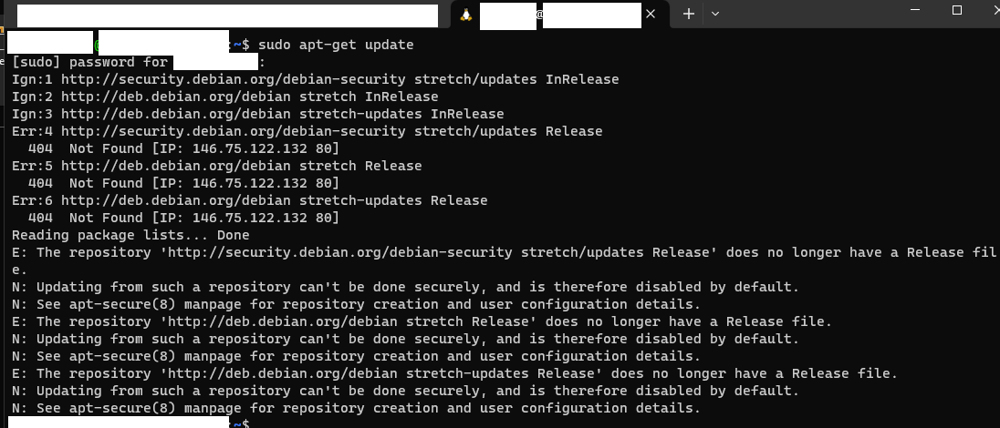

# wsl2-debian-strecher-update-failed

This is the solution to use in last resort

## Intro

A potential solution is to change the apt lists, though, depending on the status of the distribution, this is can prove to cause issues and generally is not recommended.

Also note that sometimes, it is not possible to upgrade between versions. This, of course, depends of the context you're in.

## Issue with updating WSL 2 Debian Strecher

:warning: This is to be used only when you have extracted the files you want to backup. :warning:

The following information was found from [this site](https://superuser.com/a/1766527).

Strech is **no longer supported** it seems, it has been moved into [this repo](http://security.debian.org/debian-security/zzz-dists/oldoldstable/updates/), last update being February 2023.

The following error appears after attempting a `sudo apt-get update`

```bash
The repository '<http://security.debian.org/debian-security> stretch/updates Release' does no longer have a Release file.
```



## Solution

> :warning: Highly recommend to backup **ALL FILES that you want to save** from of the WSL Debian Distribution before proceeding !
The following will purge all files and elements on the distribution !

In PowerShell, some of the following commands may be useful.

:warning: `unregister` uninstalls the distribution

```ps
wsl --list --all

wsl --list --online

wsl --unregister Debian
```

The two first commands are respectively for listing:

- installed distributions,
- all possible distributions to install.

The third command is to use with caution.
As mentioned above, it allows you to uninstall a distribution installed in WSL 2.

The `wsl --unregister Debian` is the one you want to type, depending on the name given to the debian distribution installed.
It will then uninstall it.
Note that backing up files from the distribution, through ssh, through Visual Studio Code or the file explorer to another place that isn't used by the WSL is recommended before doing the command.

Then once it is done, it will display if the operation was successful.

Then head to the Microsoft Store, click "open" or "install" when searching for Debian or from the page of applications on your pc (Windows).

A new prompt will open and you will be asked to enter the user information. The Debian version installed via Microsoft Store at the time of the creation of this repository is 11.6.
An apt-get update will install "11.7".

To verify the version : `cat /etc/debian_version`
